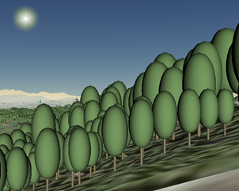
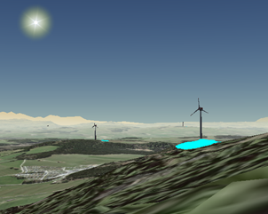

# GEOliennes - Géoportail de visualisation d'éoliennes

Géoportail de visualisation d'éoliennes basé sur le framework Vuejs.

Il est composé de :
- vuejs: 3.2
    - vue-router
    - axios
- leaflet: 1.7.1
- bulma: 0.9.3
- cesium: 1.85

## Installation

Premièrement, téléchargé le projet avec Git :

```
git clone https://github.com/Svenovitch/GEOliennes.git GEOliennes
```

Ensuite, ouvrez le répertoire dans votre ligne de commande et installer les dépendences nécessaires :

```
cd GEOliennes
npm install
npm i leaflet.polylinemeasure (si nécessaire)
```

Finalement, modifier le fichier .env à la base du projet afin de fournir votre clé Cesium ion :


```js
VUE_APP_CESIUM_ION_TOKEN=VOTRE_CLE_CESIUM_ION
```

## Exécution

### Compiler et charger pour développement
```
npm run serve
```

### Compiler et réduisez pour optimiser la production
```
npm run build
```

### Ouvrez votre navigateur à l'adresse indiquée
```
p. ex. http://localhost:8080/
```

## Documentation utilisateur

### Général

à remplir


### Onglet "Vue 2D"

à remplir


### Onglet "Vue 3D"

à remplir


## Rapport

### Concept du projet

Les projets d’éoliennes font l’objet de nombreux débats. Ils sont souvent mal perçus par la population qui les rejettent presque systématiquement.

Nous avons remarqué qu’il était parfois difficile de se représenter l’impact qu’ont de tels projets sur notre territoire. Le but de ce géoportail était alors de fournir un support sur lequel représenter les éoliennes dans leur environnement, aussi bien sur une carte 2D qu’en 3 dimensions sur un globe virtuel. 

L’affichage sur la carte 2D permet de visualiser les éoliennes sur divers fonds de plan (carte nationale et imagerie aérienne par exemple). Il est possible de zoomer sur une éolienne projetée en la choisissant dans un menu déroulant et d’afficher la portion de territoire depuis laquelle elle est visible en cliquant sur son icône. Une fonction de recherche par localité est aussi disponible, ainsi qu’un outil de mesure de distance.

L’affichage 3D permet lui de visualiser un globe virtuel sur lequel les éoliennes, les bâtiments et les arbres sont représentés. Une fonction offre la possibilité à l’utilisateur de se projeter au sol, ce qui lui permet de s’immerger dans le paysage.


### Données utilisées

#### Leaflet

Les données de bases ont été intégrées à la carte brute déjà existante dans le code source. Il s’agit des éléments suivants :
- Cartes de base en WMTS : SWISSIMAGE et carte nationale repris de Swisstopo et fond de plan de OpenStreetMap.
- Coordonnée du centre de la carte pour affichage lors de la première ouverture.
- Niveau de zoom par défaut à l’ouverture.
- Liste contenant les noms des éoliennes ainsi que leur position en latitude/longitude.
- API REST de geo.admin.ch pour la recherche de lieux par noms ;
- Viewsheds en .PNG issus d'analyses de visibilité sur QGIS.

#### Cesium

- Géoservices 3D Tiles swisstopo :
    - swissALTI3D, modèle numérique de terrain ;
    - swissTLM3D, modèle topographique du paysage (bâtiments et végétation).
- Géoservice WMTS swisstopo :
    - swissimage, orthophoto aérienne.
- Modèle 3D « Turbine », par Peter Primini, CC Attribution (sur sketchfab), testé en local puis publié sur le portail Cesium Ion.
- Emplacements des éoliennes approximatifs issus des zones d’intérêts du Plan directeur cantonal de Fribourg.


### Démarche

L’architecture de base du projet est issue du dépôt Github https://github.com/thibaud-c/seed-vuejs3.0-carto2D-3D. Après l’avoir copié sur un dépôt personnel, chacun a pu collaborer facilement grâce aux outils de versioning de Git. À ce stade, la répartition des tâches s’est effectuée principalement par composant et librairie utilisée, puis par fonctionnalité.

#### Page d'accueil

La structuration de la page d’accueil se base sur la librairie Bulma et son outil d’affichage d’éléments par tuiles. Une première partie présente l’équipe et une deuxième décrit sommairement le projet.

#### Leaflet

Premièrement, les données de bases pré-citées ont été intégrées à la carte brute déjà existante dans le code source. À partir de là, différentes fonctions ont été implémentées qui font appel à ces données de base :
- Affichage de markers avec icône pour les éoliennes. Apparition d’une popup avec son nom lors d’un clic.
- Zoom sur objet lié à un menu déroulant codé en VueJS (v-for sur la liste des éoliennes). Lorsqu’une sélection est faite, la vue se déplace aux coordonnées de l’éolienne avec un niveau de zoom défini.
- Affichage du viewshed sous forme d’une image qui s’affiche par-dessus la carte (L.imageOverlay). Cette dernière apparaît lorsque l’on clique sur le marker. Le calcul des viewsheds a été fait au préalable sur QGIS (plugin “viewshed analysis”) à l’aide du MNS raster de Swisstopo couplé aux positions des éoliennes projetées dans le Canton de Fribourg et leur hauteur fixée à 90 mètres au centre des pales.

Au niveaux des outils ajoutés à l’application, on peut citer la mesure de distance via le dessin de polylignes (librairie l.polylinemeasure) et la recherche de localités ou de lieux codée sous forme de promesse à travers la librairie Axios et en faisant appel à l’API de recherche REST de Swisstopo.

#### Cesium

Les premières modifications apportées au composant Cesium concernent l’initialisation de l’interface. On mentionnera notamment les points suivants :
- Configuration de la clé Cesium Ion ;
- Tri des éléments de l’interface à afficher ;
- Modification des paramètres par défaut dépendants des éléments de l’interface masqués, comme
    - activer les animations,
    - activer le test de profondeur des éléments affichés,
- Modification des données de base du terrain et de son mappage, afin d’avoir un modèle de terrain précis et une visualisation « photoréaliste » avec le placage de la dernière swissimage.
Ensuite, plusieurs éléments 3D ont été ajoutés au viewer :
- Ajout des données des bâtiments et de la végétation de swisstopo, afin de compléter le paysage 3D et d’offrir une visibilité cohérente avec le MNS utilisé pour le calcul des viewsheds ;
- Ajout des modèles 3D d’éoliennes et de cercles concentriques pour le repérage.

La fonction principale du composant a été de créer une commande afin de projeter la position de la caméra à 2 mètres du sol afin de visualiser le paysage et l’impact des éoliennes sur celui-ci à la première personne.


Vue du Mont Gibloux avec et sans végétation/bâtiments


### Difficultés rencontrées

De manière générale, la principale difficulté a été d’être confrontés à de nombreux outils avec des courbes d’apprentissages différentes. L’assimilation de manière autonome des spécificités de chacun puis leur application a demandé un investissement considérable, que ce soit pour comprendre la structure générale de l’application, l’application du framework VueJS ou l’apprentissage d’outil comme Cesium ou même de librairies déjà connues comme Leaflet, qu’il a fallu réapprendre d’une certaine manière. Le temps à disposition et nos connaissances limitées en développement ont ainsi relativement ralenti notre progression dans ce projet, notamment à de nombreux petits points de blocage qui nous demandaient passablement de recherches pour les résoudre et avancer.

#### Leaflet

La grande difficulté était de faire le lien entre les fonctions codées en Javascript et les éléments de navigation (barre de recherche ou menu déroulant) codés en Vue. Il a donc fallu comprendre comment se fait l’intéraction entre ce qui est écrit dans la borne <template> et les fonctions et données de base contenues dans <script>. Des boucles “v-for” sur des listes de données et des actions “@click”, “@change” ont été utilisées pour y parvenir.

Une autre partie un peu complexe était de pouvoir afficher le viewshed d’une éolienne à la demande soit par le biais du menu déroulant qui zoom dessus et affiche les zones visibles soit par un clic sur le marker de l’éolienne. De plus, il fallait faire en sorte que, si on fait de même sur une autre éolienne, on n'ait pas une accumulation de plusieurs viewsheds affichés ce qui alourdirait et ralentirait la navigation. La meilleure solution a été de faire en sorte que le viewshed s’affiche lors d’un clic sur l’éolienne avec ouverture de la popup et que celui-ci disparaisse lorsque l’on referme la popup.

La dernière difficulté concerne l’outil de recherche de lieu via l’API REST de swisstopo. En effet, il a fallu codé cela sous la forme de promesse ce qui n’a pas été évident à configurer et qui nous a pris beaucoup de temps. C’est-à-dire, que dans un premier temps, une interface Vue affiche une box permettant de taper du texte qui est liée à un bouton de recherche. Lorsque ce bouton est cliqué, une fonction exécute une requête sur l’API REST qui recherche si le texte entré correspond à une localité ou un lieu existant dans la base de donnée de Swisstopo. A partir de là, si la réponse et oui, la fonction récupère les coordonnées de ce lieu dans l’API et renvoie le résultat ce qui engendre un déplacement et un zoom sur la carte.


#### Cesium

Le plus gros point d’achoppement a été la représentation des éoliennes 3D dans le viewer. Malgré le suivi de la documentation, celles-ci ne s’affichaient pas, mais sans erreur. De nombreuses pistes ont été explorées : format de fichier, types d’objet Cesium, etc. La plus probable étant liée à l’altimétrique, notamment en raison du terrain issu des géoservices 3D Tiles. Des tests ont été réalisés, avec des promesses ou des boucles sur la valeur de l’altitude à la position des éoliennes, par exemple. Une solution partielle a été de représenter les éoliennes par des cylindres extrudés depuis le dessous du sol jusqu’à la hauteur des éoliennes. Finalement, une solution a été trouvée. Le problème étant à la fois lié à l’altimétrie et au modèle en local, en réalisant la promesse susmentionnée et un publiant le modèle non à partir de l’attribut « gltf » pour un fichier GLTF ou GLB en local, mais avec « uri » après avoir publié le modèle comme ressource en ligne sur le portail Cesium Ion.

Le second gros point d’achoppement a été la commande pour la vue au niveau du sol. Dans un premier temps, se bouton a été généré dans l’interface Cesium comme un outil par défaut, ce qui a créé plusieurs problèmes liés à l’assignation des méthodes dans un événement d’un bouton défini dans Cesium. Finalement, ce bouton a été créé en dehors du viewer.


### Perspectives

#### Leaflet

En ce qui concerne la partie 2D, la plus grande amélioration possible serait de pouvoir calculer un viewshed à la volée lorsque l’on vient cliquer un lieu qui pourrait accueillir une éolienne potentielle et ainsi se rendre compte directement des impacts paysagers. En revanche, cela impliquerait dans ce cas d’intégrer un MNS de l’entier du Canton de Fribourg dans les données en entrée ce qui ralentirait nettement le processus. De plus, ce type de calcul est extrêmement complexe dans le sens où chaque pixel d’un raster doit être défini comme visible ou non depuis un point d’observation donné au préalable.

Quelques répétitions résident encore dans le script comme, par exemple, la liste des éolienne qui sert une fois pour le menu déroulant juste avec les noms et une autre pour les zooms avec les coordonnées de chaque éolienne. De plus, les coordonnées ont été tapées en manuellement en dur alors que l’on aurait pu faire appel à un fichier JSON avec l’ensemble des points.

#### Cesium

Une fonctionnalité qui n’a pas pu être implémentée est l’initialisation de la vue Cesium à la position de la vue Leaflet. L’idée était d’activer les viewsheds dans la vue 2D, de se placer au-dessus d’un emplacement touché par un superposition de viewsheds, puis de se rendre dans la vue 3D pour visualiser l’impact sur le paysage directement depuis ce même point.

Les positions des mâts font doublons avec les données du composant Leaflet. Une communication child-to-child serait plus adaptée.

Plusieurs contrôles peuvent éventuellement être étudiés pour améliorer l’expérience “à la première personne”.
Finalement, la qualité du modèle 3D et ses dimensions pourraient être modifiés pour correspondre plus rigoureusement à des installations projetées.


### Conclusion

Le géoportail élaboré correspond quasiment à toutes nos attentes de base. Les éoliennes peuvent être visualisées tant en 2D qu’en 3D. Un modèle 3D d’éolienne a même pu être intégré rendant le rendu plus réaliste. Malgré quelques détails qui pourraient être améliorés et les perspectives de développement exposées précédemment, le rendu en l’état nous satisfait amplement.

Nous avons particulièrement apprécié de pouvoir travailler aussi bien en groupe qu’en autonomie pour certains points, tout en étant judicieusement encadrés. Ce travail nous a permis de réutiliser certaines connaissances que nous avions en les appliquant à des nouveaux outils que nous ne connaissions pas.